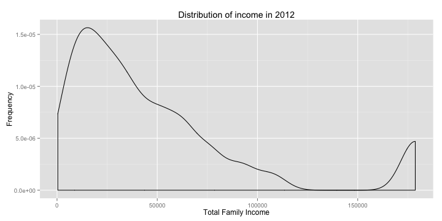
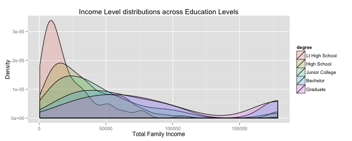

### What is the relationship between one’s highest level education level attained and one’s income?


### Introduction:


“An investment in education pays the best interest” - Benjamin Franklin.  
It is often said that education is the key to success.  It broadens one’s mind, builds confidence to make decisions, face challenges and accept failures in life, and opens the door to new and better job opportunities.  (Notwithstanding, some of the world’s richest and successful people were school drop outs.  Steve Jobs never graduated from college and Bill Gates dropped out of university; they are the outliers who prove that one’s success does not completely depend on education).

However, consider the cost of education.  According to an article from Bloomberg, college costs have surged 500% in the US since 1985.  Average tuition and fees at private schools in the 2013 - 2014 academic year was $30,094, up from $18,060 in 2002 - 2003, based on the College Board’s statistics.  Consider also the ballooning education debt, which exceeded $1 trillion in the third quarter of 2013; the average debt load for the class of 2012 was $29,400.  

In light of the above, this paper will attempt to answer the following question: "What is the relationship between one’s highest level education level attained and one’s income?”.  Does education, across all levels, lead to higher income?  Or do some education qualifications lead to greater increases in income?

### Data:

To examine the research question above, this paper will be using data from the General Social Survey (“GSS”), a sociological survey used to collect data on demographic characteristics and attitudes of residents of the United States.  While the GSS provides data from 1972 - 2012, to simplify the analyses, I will examine only responses from the year 2012.  The intent is to control for possible confounding variables including time, improvements in the education system, and rising levels of income.  

Data collection for the GSS was conducted through (i) computer-assisted personal interviews, (ii) face-to-face interviews, (iii) and telephone interviews).  For the 2012 GSS data, the cases were a sample of all English and Spanish speaker people age 18 and over who were living in households at the time of the survey (or non-institutionalised) in the US.  The two variables studied are the highest level of education attained (“education”) and total family income in constant dollars (“income”); given that there is no data collected on personal income, total family income will be examined as a proxy instead.  In addition, while a measure of income in current dollars is available, I will examine income in constant dollars (i.e., inflation-adjusted income) to allow for comparison across time in future studies.  Education is a categorical level with 5 levels (i.e., “Less than High School”, “High School”, “Junior College”, “Bachelor”, “Graduate” (i.e., Masters and above) and is labeled “degree" in the dataset.  Income is a continuous variable ranging from $383 - $178712, with a median of $34470, and is labeled “coninc” in the data set.

The type of study is an observational study given that no random assignment of individuals to different conditions/treatments was conducting.  With regard to sampling, full probability sampling, where every individual had a chance of being selected, was conducted; notwithstanding, there are some exceptions to this which will be discussed below.  The sampling methodology is stratified sampling, where the population was stratified first by region followed by country.  With regard to experimental design, there was no random assignment of individuals to different conditions or treatments.  

With regard to generalizability, the population of interest is the working US population.  Given that the GSS data was collected via full probability sampling on the entire US population, the findings from this paper can be generalised to the entire working US population.  Potential sources of bias in the GSS may arise given that the GSS does not sample from (i) minors and (ii) people who do not speak either English and Spanish.  With regard to (i), the bias is likely to be minor (pun intended) given that our interest is examining one’s personal income; this is based on the assumption that minors are likely to still be pursuing an education and not have an income.  With regard to (ii), a quick check and calculation from a 2011 Census on language use in the US suggests that 0.294% of the US population do not speak English and/or Spanish.  Taking the above into account, the biases from the GSS are likely to have a negligible impact on the generalizability of this study.

With regard to causality, the data cannot be used to establish causal links between the variables of interest as there was no random assignment to the explanatory/independent variable (i.e., education).  Morally, randomly assignment people to different levels of education would be highly unethical.

### Exploratory data analysis:


```
## Lt High School    High School Junior College       Bachelor       Graduate 
##            222            869            130            319            180
```

```
## Lt High School    High School Junior College       Bachelor       Graduate 
##        0.12907        0.50523        0.07558        0.18547        0.10465
```


From the table above, we observe that most of the US population have education level of high school and below, with approximately 28.5% having a Bachelor, Masters, and above.  


```
##    Min. 1st Qu.  Median    Mean 3rd Qu.    Max. 
##     383   16300   34500   48800   63200  179000
```

 


From the table above, the median income in the US in 2012 is $34470, with a mean of $48850, and a range of $383 - $178712.  The graph also shows that income distribution is bimodal and right skewed, with a gap between $125000 and $160000 another smaller peak at the top 10% of income.  

  


The box plot of income at different education levels suggests that there is a relationship between income and education.  An alternative visualization, the overlapping distribution plots, further bolsters the relationship between education and income, warranting a deeper investigation of the research question.

### Inference:

The hypotheses for this study are as stated below:   
Null Hypothesis: The mean income is the same across all levels of education.   
Alternative Hypothesis: At least one pair of mean incomes are different from each other.

There are three conditions for ANOVA, namely (i) independence, (ii) approximate normality, and (iii) equal variance.  For (i), the data was randomly sampled with full probability sampling, with the sample size for education group being less than 10% of the population and independent of each other.  For (ii), while the normal probability plots for each of the groups below show that the data is right skewed and deviates from normality, this is mitigated by the large samples sizes for each education group.  For (iii), the box plot of income by education level shows that there is roughly constant variance for the High School, Junior College, and Bachelor groups, while the Less that High School group has lower variance while the Graduate group has higher variance.  To address this, a non-parametric test such as the Kruskal-Wallis test can be used; however, this is not covered under the class syllabus.  Thus, this study will proceed with the ANOVA analysis.

 


Given that the means between more than two groups (i.e., five) will be compared, the method to be used in this study is the analysis of variance (“ANOVA”).  The ANOVA analysis will compare the means across the five groups and determine if the observed differences are attributed to between group variability (i.e., education) or within group variability (other factors).  


```r
# anova of gss2012$coninc ~ gss2012$degree
inference(y = gss2012$coninc, x = gss2012$degree, est = "mean", type = "ht", 
    null = 0, alternative = "greater", method = "theoretical")
```

```
## Response variable: numerical, Explanatory variable: categorical
## ANOVA
## Summary statistics:
## n_Lt High School = 222, mean_Lt High School = 21657, sd_Lt High School = 22693
## n_High School = 869, mean_High School = 37665, sd_High School = 35146
## n_Junior College = 130, mean_Junior College = 46221, sd_Junior College = 39487
## n_Bachelor = 319, mean_Bachelor = 75871, sd_Bachelor = 55549
## n_Graduate = 180, mean_Graduate = 90371, sd_Graduate = 58309
```

```
## H_0: All means are equal.
## H_A: At least one mean is different.
## Analysis of Variance Table
## 
## Response: y
##             Df   Sum Sq  Mean Sq F value Pr(>F)
## x            4 8.17e+11 2.04e+11     118 <2e-16
## Residuals 1715 2.98e+12 1.74e+09               
## 
## Pairwise tests: t tests with pooled SD 
##                Lt High School High School Junior College Bachelor
## High School                 0          NA             NA       NA
## Junior College              0      0.0291             NA       NA
## Bachelor                    0      0.0000              0       NA
## Graduate                    0      0.0000              0    2e-04
```

 


```
## [1] "Bonferroni Correction: Modified Significance Level = 0.5/((5*4)/2) = 0.005"
```


#### Income Quantiles Segmented by Education Level

```
## gss2012$degree: Lt High School
##     0%    25%    50%    75%   100% 
##    383   6894  14363  28725 178712 
## -------------------------------------------------------- 
## gss2012$degree: High School
##     0%    25%    50%    75%   100% 
##    383  14363  28725  51705 178712 
## -------------------------------------------------------- 
## gss2012$degree: Junior College
##     0%    25%    50%    75%   100% 
##    383  18193  34470  63195 178712 
## -------------------------------------------------------- 
## gss2012$degree: Bachelor
##     0%    25%    50%    75%   100% 
##    383  34470  63195  91920 178712 
## -------------------------------------------------------- 
## gss2012$degree: Graduate
##     0%    25%    50%    75%   100% 
##   2681  42130  76600 178712 178712
```


The p-value from the ANOVA is almost 0 (i.e., less than 2.2e-16).  Thus, we reject the null hypothesis, at the 5% significance level, and conclude that the data provides convincing evidence that at least one pair of income means are different from each other.  To examine which education levels different in mean incomes, we will examine the pairwise tests with a modified significance level is 0.5% (based on the Bonferroni correction).  At the 0.5% significance level, the p-values from the pairwise tests are all significant, except for the high school-junior college pair.  Thus, we conclude that the data provides convincing evidence that the mean income is different across all education pairs except for the high school-junior college pair.  The box plots of the high school and junior college levels also suggests this, given that the centres are close to each other.  There is no associated confidence interval for the ANOVA technique and thus there is nothing to compare the ANOVA results with. 

### Conclusion:

To summarise the findings, the GSS 2012 data provides evidence that there is a significant and positive relationship between education and income, where higher education qualifications lead to higher incomes.  Notwithstanding, it should be noted that there is no significant difference in income between individuals with a high school education and individuals with a junior college education.  

What is the return on investment (ROI) of a Bachelor’s degree?  Examining income quantiles segmented by education level, the median income of a bachelor degree holder is $28,735 higher than the median income of one with only a junior college education; putting it in another perspective, bachelor degree holders earn nearly twice that of junior college graduates.  Recall that in the introduction, it was shared that the average education debt load for 2012 was $29,400.  Assuming a buoyant economy and degree job, the increase in median income from a Bachelor degree should be able to pay off the education debt incurred.  

What about Graduate degree holders (i.e., Masters, PhDs)?  Based on median income, graduate degree holders earn $13,405 more than bachelor degree holders.  This may not seem like much.  However, examining income at the 75th percentile, graduate degree holders earn nearly twice as much as bachelor degree holders, with a difference of $86,762.  Therefore, it seem that for the top 25%, a graduate degree does indeed pay the best interest.  

However, this is not to say that one’s income in limited by their level of education.  Referring to the box plots in exploratory data analysis, there are outliers at every education level that earn extremely high income.  This is further seen in the overlapping distribution plots, where high income earners at the right tail of the distribution is made up of all education levels (though they are predominantly bachelor degree and graduate degree holders).  

One possible shortcoming is that the current data does not include people who do not speak either English or Spanish.  While this is only 0.294% of the population, future research could try to include this segment of the population.  In addition, the current analyses does not take into account and control for possible extraneous variables such as age, gender, and family background (i.e., family income at the age of 16).  It would be exciting to examine the relationship between these variables and current income in a multiple regression model in the future.

### Further analysis:
Note: the author has done a multiple regression analysis with (i) education, (ii) age, (iii) gender, and (iv) family income at the age of 16 as explanatory variables with current income as the response variable.  In a nutshell, (i) education continues to be strongly related to current income, (ii) age does not have a significant relationship with income, (iii) gender is significantly related to income, with females earning less, and (iv) family income is significantly related to current income only if your family income was above average.  The summary of the regression model is appended below.  

```
## 
## Call:
## lm(formula = gss2012$coninc ~ gss2012$degree + gss2012$incom16 + 
##     gss2012$sex)
## 
## Residuals:
##    Min     1Q Median     3Q    Max 
## -92835 -24853  -9533  14056 154903 
## 
## Coefficients:
##                                  Estimate Std. Error t value Pr(>|t|)    
## (Intercept)                         22427       4106    5.46  5.4e-08 ***
## gss2012$degreeHigh School           15057       3153    4.77  2.0e-06 ***
## gss2012$degreeJunior College        23795       4593    5.18  2.5e-07 ***
## gss2012$degreeBachelor              51527       3704   13.91  < 2e-16 ***
## gss2012$degreeGraduate              66001       4218   15.65  < 2e-16 ***
## gss2012$incom16Below Average         1152       3811    0.30   0.7624    
## gss2012$incom16Average               2916       3662    0.80   0.4259    
## gss2012$incom16Above Average        13024       4228    3.08   0.0021 ** 
## gss2012$incom16Far Above Average     7504       7162    1.05   0.2949    
## gss2012$sexFemale                   -6123       2007   -3.05   0.0023 ** 
## ---
## Signif. codes:  0 '***' 0.001 '**' 0.01 '*' 0.05 '.' 0.1 ' ' 1
## 
## Residual standard error: 41400 on 1710 degrees of freedom
## Multiple R-squared:  0.227,	Adjusted R-squared:  0.223 
## F-statistic: 55.8 on 9 and 1710 DF,  p-value: <2e-16
```

```
## [1] "Note: Age was not included in the regression model as a prior t-test had showed no significant relationship between age and current income"
```


### References:

Smith, Tom W., Michael Hout, and Peter V. Marsden. General Social Survey, 1972-2012 [Cumulative File]. ICPSR34802-v1. Storrs, CT: Roper Center for Public Opinion Research, University of Connecticut /Ann Arbor, MI: Inter-university Consortium for Political and Social Research [distributors], 2013-09-11. doi:10.3886/ICPSR34802.v1. 
URL: http://www.icpsr.umich.edu/icpsrweb/ICPSR/studies/34802/version/1
Dataset URL: http://bit.ly/dasi_gss_data

Jamrisko, M., and Kolet, I. (2013, Aug 2013).  College Costs Surge 500% in U.S. Since 1985: Chart of the Day.  Retrieved from http://www.bloomberg.com/news/2013-08-26/college-costs-surge-500-in-u-s-since-1985-chart-of-the-day.html

Gage, C. S., and Lorin, J. (2014, Jan 15).  Fed Student-Loan Focus Shows Recognition of Growth Risk.  Retrieved from http://www.bloomberg.com/news/2014-01-15/fed-student-loan-focus-recognizes-threat-to-u-s-economy.html

Ellis, B. (2013, Dec 5).  Average student loan debt: $29,400.  Retrieved from http://money.cnn.com/2013/12/04/pf/college/student-loan-debt/
